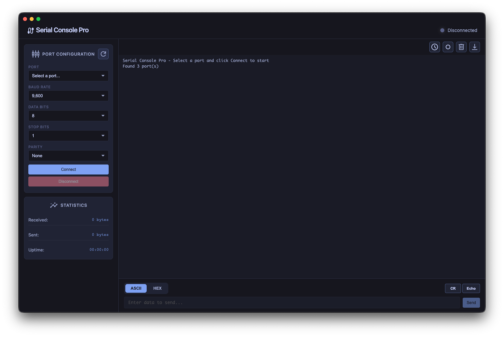

# Serial Console Pro

A beautiful, professional cross-platform serial console application built with Electron and TypeScript. Monitor and communicate with serial devices through an elegant, modern interface.

   



## Platform support

### Prebuilt binaries are published on GitHub Releases for:

- **macOS** 
- **Linux**
- **Windows**

## Features

### Core Functionality
- **Auto-detect serial ports** - Automatically discovers all available serial ports
- **Real-time communication** - Send and receive data with instant feedback
- **Beautiful UI** - Modern, dark-themed interface with smooth animations
- **High performance** - Efficient data handling and rendering

### Serial Port Settings
- **Baud Rate**: 300 - 921,600 baud (industry standard rates)
- **Data Bits**: 5, 6, 7, 8
- **Stop Bits**: 1, 2
- **Parity**: None, Even, Odd, Mark, Space
- **Flow Control**: Supported through serialport library

### Data Formats
- **ASCII Mode** - Send and receive human-readable text
- **HEX Mode** - Work with raw hexadecimal data
- **CR+LF Support** - Optional line ending addition
- **Local Echo** - See what you're sending in the terminal

### Terminal Features
- **Live Statistics** - Track RX/TX bytes and connection uptime
- **Timestamps** - Every message timestamped for debugging
- **Color-coded messages** - Visual distinction between sent/received data
- **Clear terminal** - Fresh start with one click
- **Auto-scroll** - Toggle automatic scrolling
- **Error highlighting** - Instantly spot errors and warnings

## Quick Start

### Installation

```bash
npm install
```

### Build

```bash
npm run build
```

### Run

```bash
npm start
```

## Project Structure

```
serial-console-pro/
├── src/
│   ├── main/              # Main process (Node.js environment)
│   │   └── index.ts       # Serial port management & IPC handlers
│   ├── preload/           # Secure bridge between processes
│   │   └── preload.ts     # Context bridge API exposure
│   └── renderer/          # Renderer process (Browser environment)
│       ├── index.html     # Application UI structure
│       ├── renderer.ts    # UI logic & serial communication
│       ├── types.d.ts     # TypeScript type definitions
│       └── styles.css     # Modern styling
├── dist/                  # Compiled output
├── package.json
└── tsconfig.json
```

## Usage Guide

### Connecting to a Device

1. **Select Port**: Choose your serial device from the dropdown
2. **Configure Settings**: Set baud rate and other parameters
3. **Click Connect**: Establish the connection
4. **Start Communicating**: Send and receive data

### Sending Data

**ASCII Mode:**
- Type your message in the input field
- Optionally enable "Add CR+LF" for line endings
- Press Enter or click Send

**HEX Mode:**
- Enter hexadecimal bytes (e.g., `48 65 6C 6C 6F`)
- Spaces are optional and ignored
- Click Send to transmit

### Terminal Controls

- **Clear Terminal** - Remove all messages
- **Toggle Autoscroll** - Enable/disable automatic scrolling
- **Refresh Ports** - Rescan for available serial ports

### Reading Data

- Incoming data appears with a **←** arrow in cyan
- Outgoing data appears with a **→** arrow in yellow
- All messages include timestamps
- Color coding for errors, warnings, and info messages

## Security

This application follows Electron security best practices:

- **Context Isolation** - Renderer process is sandboxed
- **No Node Integration** - Renderer doesn't have direct Node.js access
- **Preload Scripts** - Safe IPC communication via contextBridge
- **CSP Headers** - Content Security Policy enforced
- **Secure by Default** - All dangerous features disabled

## Development

### Scripts

| Command | Description |
|---------|-------------|
| `npm install` | Install dependencies |
| `npm run build` | Compile TypeScript and copy assets |
| `npm start` | Build and run the application |
| `npm run dev` | Quick development build and run |

### Tech Stack

- **Electron** - Cross-platform desktop framework
- **TypeScript** - Type-safe JavaScript
- **SerialPort** - Node.js serial port communication
- **Material Icons** - Icon font for UI elements
- **Native CSS** - Custom styling with CSS variables

## Customization

### Changing Colors

Edit CSS variables in [src/renderer/styles.css](src/renderer/styles.css):

```css
:root {
  --accent-primary: #00d4ff;    /* Primary accent color */
  --accent-secondary: #7000ff;  /* Secondary accent */
  --bg-primary: #0f0f1e;        /* Main background */
  /* ... more variables */
}
```

### Adding IPC Methods

1. **Main Process** ([src/main/index.ts](src/main/index.ts)):
```typescript
ipcMain.handle('custom:method', async (event, data) => {
  // Your logic here
  return result;
});
```

2. **Preload** ([src/preload/preload.ts](src/preload/preload.ts)):
```typescript
contextBridge.exposeInMainWorld('electronAPI', {
  custom: {
    method: (data: any) => ipcRenderer.invoke('custom:method', data)
  }
});
```

3. **Renderer** ([src/renderer/renderer.ts](src/renderer/renderer.ts)):
```typescript
const result = await window.electronAPI.custom.method(data);
```

## Common Use Cases

- **Embedded Development** - Debug microcontrollers and IoT devices
- **Hardware Testing** - Communicate with serial peripherals
- **Data Logging** - Monitor and record serial data streams
- **Protocol Analysis** - Debug serial communication protocols
- **Automation** - Script serial device interactions

## Troubleshooting

### Port Access Issues (macOS/Linux)
```bash
# Add user to dialout group (Linux)
sudo usermod -a -G dialout $USER

# Grant permissions (macOS)
# System will prompt for permission on first access
```

### Port Already in Use
- Close other applications using the serial port
- Disconnect and reconnect the USB device
- Check if another instance is running

### Build Errors
```bash
# Clean install
rm -rf node_modules dist
npm install
npm run build
```

## Contributing

Contributions are welcome! Please feel free to submit a Pull Request. For major changes, please open an issue first to discuss what you would like to change.

### Development Setup

1. Fork the repository
2. Clone your fork: `git clone https://github.com/miroslavpetrov/serial-console-pro.git`
3. Create a feature branch: `git checkout -b feature/amazing-feature`
4. Install dependencies: `npm install`
5. Make your changes
6. Build and test: `npm run build && npm start`
7. Commit your changes: `git commit -m 'Add some amazing feature'`
8. Push to the branch: `git push origin feature/amazing-feature`
9. Open a Pull Request

## License

MIT License

Copyright (c) 2025 Serial Console Pro

Permission is hereby granted, free of charge, to any person obtaining a copy
of this software and associated documentation files (the "Software"), to deal
in the Software without restriction, including without limitation the rights
to use, copy, modify, merge, publish, distribute, sublicense, and/or sell
copies of the Software, and to permit persons to whom the Software is
furnished to do so, subject to the following conditions:

The above copyright notice and this permission notice shall be included in all
copies or substantial portions of the Software.

THE SOFTWARE IS PROVIDED "AS IS", WITHOUT WARRANTY OF ANY KIND, EXPRESS OR
IMPLIED, INCLUDING BUT NOT LIMITED TO THE WARRANTIES OF MERCHANTABILITY,
FITNESS FOR A PARTICULAR PURPOSE AND NONINFRINGEMENT. IN NO EVENT SHALL THE
AUTHORS OR COPYRIGHT HOLDERS BE LIABLE FOR ANY CLAIM, DAMAGES OR OTHER
LIABILITY, WHETHER IN AN ACTION OF CONTRACT, TORT OR OTHERWISE, ARISING FROM,
OUT OF OR IN CONNECTION WITH THE SOFTWARE OR THE USE OR OTHER DEALINGS IN THE
SOFTWARE.

## Acknowledgments

- Built with [Electron](https://www.electronjs.org/)
- Serial communication via [node-serialport](https://serialport.io/)
- Inspired by professional serial console applications
